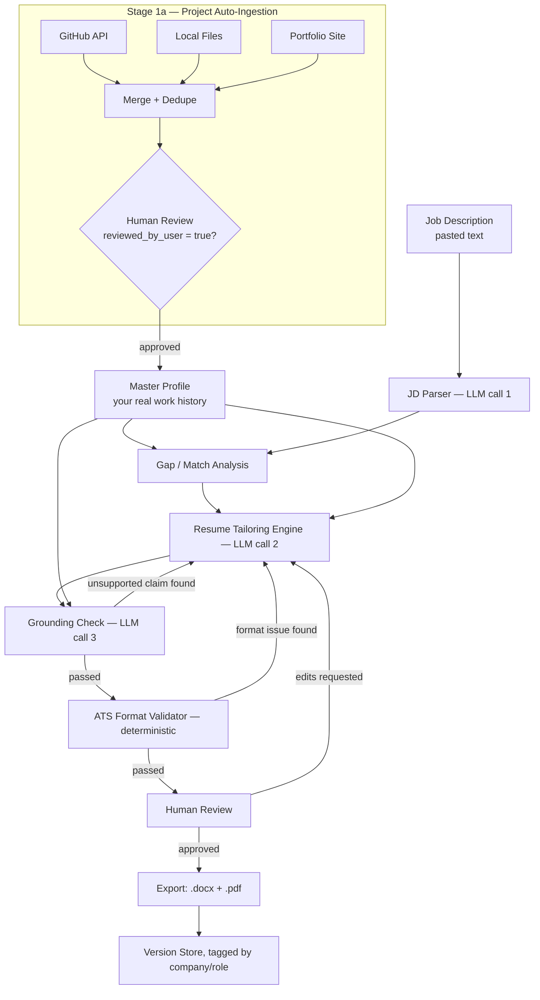

# Technical Architecture
## ResumeForge — JD-to-Resume Tailoring Pipeline

**Companion to `PRD.md`.** This doc covers system design, data schemas, tech stack, and storage/security. Prompt templates live in `ATS_Guidelines_and_Prompt_Design.md`.

---

## 1. System Overview

Ten stages, three LLM calls, two deterministic checks, one hard checkpoint (you) before anything gets exported.



The two feedback loops (grounding check → back to tailoring; format validator → back to tailoring) are the whole point of the architecture: nothing reaches you as a "final" draft without being checked by something other than the process that wrote it.

## 2. Pipeline Stage Breakdown

### Stage 1 — Master Profile Intake
One-time, then maintained over time. Two entry paths:
- Manual structured entry (form or hand-edited JSON/YAML).
- **Bootstrap from an existing resume:** upload your current resume, run it through an extraction prompt (same LLM, structured-output mode), and confirm/correct the result. This removes the "re-type my whole career" friction that kills most personal tools like this before they get used.

### Stage 1a — Project Auto-Ingestion (the "scraper")
Feeds Stage 1 rather than replacing it. Three source-specific modules, one shared `Project` schema, merged and deduped before anything touches the Master Profile:

| Source | Method | Notes |
|---|---|---|
| GitHub | Official REST API (`/user/repos`, `/repos/{o}/{r}/readme`, `/repos/{o}/{r}/languages`), authenticated with a personal access token | Not HTML scraping — this is the sanctioned, ToS-compliant path. Pulls description, README, detected languages, created/pushed dates, public/private status. Forks and near-empty repos are filtered out by default. |
| Local files | Filesystem walk of a projects root directory; README read directly; tech stack inferred from manifest files (`package.json`, `pyproject.toml`, `Cargo.toml`, etc.); dates from `git log` if the folder is a repo | Catches unpushed/private work GitHub never sees. No network calls. |
| Portfolio site | `requests` + `BeautifulSoup`, sitemap-first discovery with a CSS-selector fallback | It's your own site, so no ToS concern — but unlike GitHub there's no universal API, so the selectors need to be configured per-site. Generic template provided; tighten it once the site's actual structure is known. |

**Dedup:** the same project frequently exists as both a local folder and a GitHub repo. The local scraper captures each project's git remote URL; the merge step drops any local entry whose remote matches an already-captured GitHub `source_ref`, keeping the GitHub version (richer metadata) as the canonical one.

**Trust boundary:** every record this stage produces is written with `reviewed_by_user: false`. This output is *raw material*, not Master Profile content yet. It needs to pass through an extraction step (turn README/commit text into draft resume bullets — see `ATS_Guidelines_and_Prompt_Design.md`, Project Extraction prompt) and a human review pass before Stage 5 is allowed to treat it as ground truth. Skipping this gate would quietly reopen the fabrication risk the rest of the pipeline is built to close (`PRD.md §8`), just via an automated path instead of a generative one.

Reference implementation: `/project_scraper` (`github_scraper.py`, `local_scraper.py`, `portfolio_scraper.py`, `main.py` — tested and working for GitHub/local; portfolio needs your site's selectors filled in).

### Stage 2 — JD Ingestion
Paste-first. A pasted-URL fetch is a reasonable v2 addition, but many job boards render postings via JavaScript or block scraping in their ToS, so paste should remain the reliable path, not a fallback.

### Stage 3 — JD Parsing (LLM call #1)
Structured extraction into the JD schema (§3). Low temperature (~0–0.2) — this is an extraction task, not a creative one, and you want it consistent.

### Stage 4 — Gap / Match Analysis
Mostly deterministic: diff the JD's `keywords_for_ats` and requirement list against the Master Profile's skills/experience. Compute a coverage percentage. This stage doesn't need an LLM call by itself if Stage 3's output is well-structured — simple set comparison is enough, which keeps this step fast and free.

### Stage 5 — Tailoring Generation (LLM call #2)
The core generative step. Inputs: Master Profile (full) + JD Requirements (structured) + Gap Analysis output. Moderate temperature (~0.3–0.5) — enough room to rephrase naturally, not so much that it drifts from the source material. Full prompt in the companion doc.

### Stage 6 — Grounding Check (LLM call #3)
A *separate* call (different prompt, ideally you could even use a different, cheaper model) whose only job is to fact-check Stage 5's output against the Master Profile and flag anything unsupported. Doing this as an independent pass — not just trusting Stage 5 to police itself — is what makes the zero-fabrication guarantee real rather than aspirational.

### Stage 7 — ATS Format Validation (deterministic, no LLM)
Programmatic checks against the exported document structure:
- Single-column layout (no floating text boxes / multi-column sections)
- No tables used for layout (tables for layout, not content, are a classic parsing failure point)
- Contact info in the document body, not header/footer
- Standard section headings present (`Experience`, `Education`, `Skills`, not creative alternatives)
- Font from an approved list (Arial, Calibri, Georgia, Times New Roman, Helvetica, Tahoma, Verdana)
- 1–2 page length
- For PDF export specifically: verify a real text layer exists (not a rasterized/image page) — the practical test is whether individual words are selectable, not just the whole block

### Stage 8 — Human Review
A diff view: your original Master Profile bullet next to the tailored version, accept/reject/edit per line. This is the hard checkpoint referenced throughout the PRD — nothing skips it in v1.

### Stage 9 — Export
Generate `.docx` as the default (see `ATS_Guidelines_and_Prompt_Design.md §3` for why), `.pdf` as a secondary option. If building with Python, `python-docx` is the standard library; if building with Node, the `docx` npm package works well — either way, avoid tables-as-layout and literal bullet characters (use real list/numbering styles), which are the same footguns that break both ATS parsing *and* clean document generation in general.

### Stage 10 — Version Store
Save each export tagged with `company`, `role`, `date`, and a pointer back to which JD it was generated from. Even a flat directory of files with a consistent naming convention (`Company_Role_Date.docx`) plus a simple JSON index is enough for v1 — this doesn't need a database until you're managing dozens of concurrent applications.

## 3. Data Schemas

### Master Profile
```json
{
  "personal_info": {
    "full_name": "",
    "email": "",
    "phone": "",
    "location": "",
    "linkedin_url": "",
    "portfolio_url": ""
  },
  "summary": "",
  "work_experience": [
    {
      "id": "we_1",
      "company": "",
      "title": "",
      "location": "",
      "start_date": "YYYY-MM",
      "end_date": "YYYY-MM or null",
      "is_current": false,
      "bullets": [
        { "id": "b_1", "text": "", "skills_tags": [], "metrics": [] }
      ]
    }
  ],
  "education": [
    { "id": "ed_1", "institution": "", "degree": "", "field": "", "graduation_date": "" }
  ],
  "skills": {
    "technical": [],
    "tools": [],
    "soft": [],
    "languages": []
  },
  "certifications": [],
  "projects": []
}
```

### JD Extraction (output of Stage 3)
```json
{
  "job_title": "",
  "company": "",
  "seniority_level": "",
  "employment_type": "",
  "must_have_requirements": [
    { "requirement": "", "category": "hard_skill | soft_skill | tool | certification | experience_years | education", "keywords": [] }
  ],
  "nice_to_have_requirements": [ "..." ],
  "core_responsibilities": [],
  "keywords_for_ats": [],
  "company_context": { "industry": "", "size": "", "notes": "" }
}
```

### Tailored Resume Output (output of Stage 5, checked in Stage 6)
```json
{
  "job_id_ref": "",
  "generated_at": "",
  "summary": "",
  "selected_experience": [
    { "source_bullet_id": "b_1", "tailored_text": "" }
  ],
  "selected_skills": [],
  "keyword_coverage": { "matched": [], "missing": [], "coverage_pct": 0 },
  "grounding_check": { "unsupported_claims": [], "passed": true },
  "ats_validation": { "passed": true, "issues": [] }
}
```

Note the `source_bullet_id` field on every tailored line — that's what makes the grounding check and the human review diff possible. If a tailored line can't point back to a Master Profile bullet ID, it shouldn't exist.

## 4. Tech Stack Recommendation

This is a recommendation, not a requirement — adjust to your comfort level. All of it is buildable incrementally starting from a single script.

| Layer | Recommendation | Why |
|---|---|---|
| LLM | Claude API, structured outputs (`output_config.format` for JSON mode, or `strict: true` tool use) | Guarantees schema-valid JSON back from each call instead of you having to parse free-form text — directly relevant here since every stage passes structured data to the next. |
| Model per stage | Cheaper/faster model (e.g. Haiku-tier) for Stage 3 (parsing) and Stage 6 (grounding check) — both are closer to mechanical extraction/verification. A stronger model (e.g. Sonnet-tier) for Stage 5 (the actual tailoring/rewriting), since that's where writing quality matters most. | Keeps per-resume cost low without sacrificing quality where it counts. Confirm current model names/pricing at [docs.claude.com](https://docs.claude.com) since the lineup changes. |
| Backend | Python (FastAPI) or a simple script to start | `python-docx` for export, easy Claude SDK integration, minimal ceremony for a personal tool. |
| Doc export | `python-docx` (Python) or `docx` (Node) | Both support the plain, standard-styles-only formatting ATS needs. Avoid literal `\n`, avoid tables as layout, use built-in heading styles, use real numbering configs for bullets (not typed `•` characters). |
| Storage (v1) | Local JSON/SQLite | You're the only user; no need for a hosted database yet. |
| Storage (if scaling later) | Postgres | Only if you outgrow single-user/local. |
| Frontend (v1) | CLI or a simple Streamlit app | Fast to build, enough to review diffs and approve exports. |
| Frontend (v2) | Lightweight React/web app | If you want browser/phone access to your version history. |

## 5. ATS Compliance Validator — Implementation Notes

This should be pure code, not an LLM call — it's checking document structure, which is deterministic:
1. Parse the generated `.docx` XML (or use `python-docx`'s object model) and assert: heading styles used for section headers, no tables outside of genuinely tabular content (if any), font family in the approved list, no text in header/footer sections.
2. For the PDF export, extract text programmatically and confirm the extracted text is non-empty and roughly matches the source content length — an empty or near-empty extraction means it rasterized as an image, which is an automatic fail.
3. Fail closed: any check that doesn't pass routes back to Stage 5/8 rather than silently exporting anyway.

## 6. Security & Privacy

- Master Profile and generated resumes are PII. Encrypt at rest if stored anywhere beyond your local machine.
- Don't log full resume/profile content in plaintext application logs.
- Minimize retention — you don't need to keep every intermediate LLM response forever, just the final versions and enough metadata to reconstruct what happened if needed.
- If using the Claude API, check current data-handling/retention terms at [docs.claude.com](https://docs.claude.com) rather than assuming — these are the kind of details that change over time.

## 7. Deployment Tiers

Pick based on how much "product" you actually want:
1. **Script tier:** a Python script you run locally per application. Fastest to build, zero hosting.
2. **Personal app tier:** Streamlit or a small FastAPI + minimal frontend, run locally, gives you the review UI and version history without deploying anywhere.
3. **Hosted tier:** deploy the app tier somewhere (Render/Vercel/Fly.io) if you want access from your phone mid-search.

Start at tier 1. Move up only if the friction of the lower tier is actually costing you time.

## 8. Future Integrations

Not v1, but worth knowing they're available when you get there — you already have some of these connectors set up:
- **Google Drive** — store the Master Profile and version history somewhere durable and backed up.
- **Gmail** — auto-detect application-confirmation emails to help populate the outcome tracker (Phase 3 in the PRD).
- **Google Calendar** — log interview dates against the version that got you there.
- **RankedIn (career intelligence)** — potential enrichment source for company/role context in Stage 3.

None of these are required for the MVP — the core loop (paste JD → tailored, checked, exported resume) works entirely without them.
